# Obsidian LiveSync Setup

1. Download [Obsidian](https://obsidian.md/download)

2. Create a new Vault in a local storage location
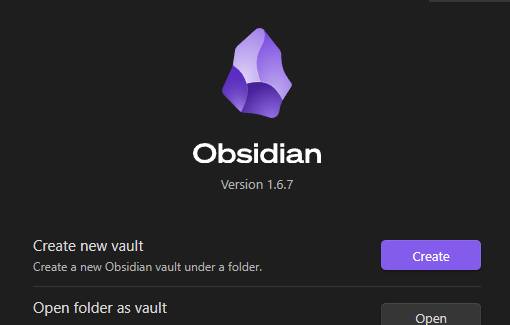
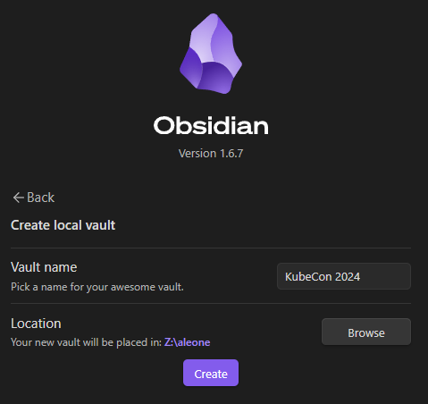

3. Navigate to the Settings modal

4. Click "Community Plugins", turn on, and browse.
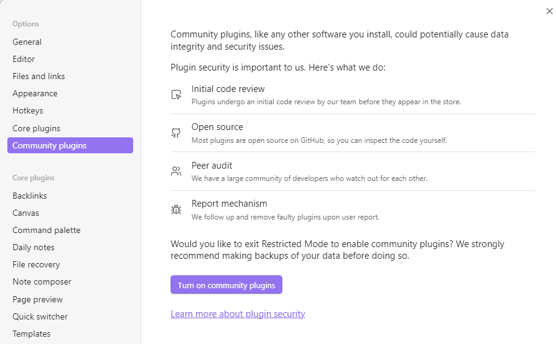
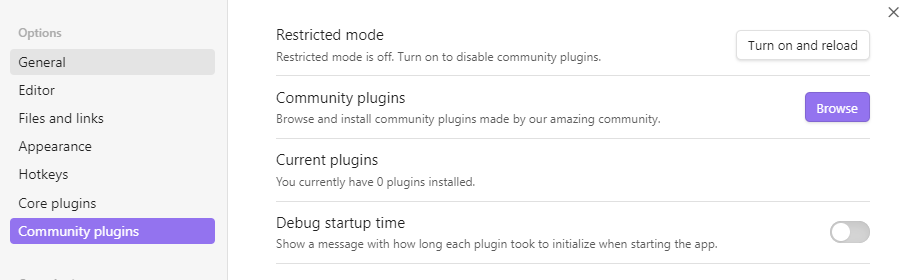

5. Search for "Self-hosted LiveSync", install, and enable
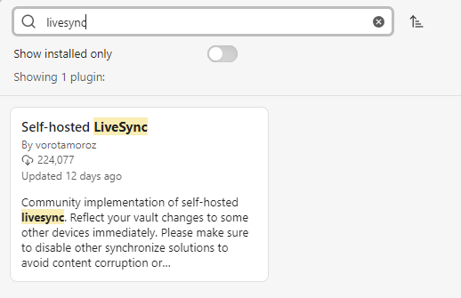
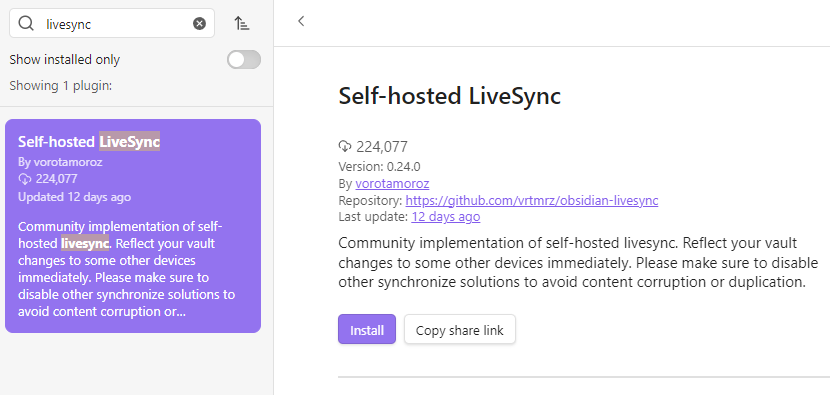
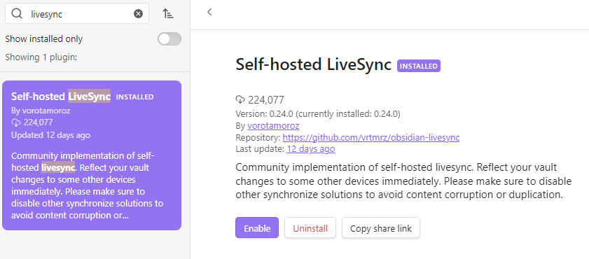

6. Configure LiveSync

  a. Initialize with Setup URI
  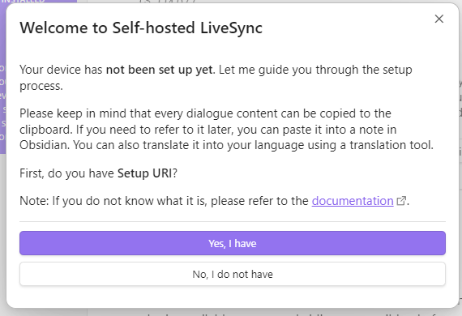

  b. Enter this URI: 
  `obsidian://setuplivesync?settings=%256ca7bae7ea9652dae9106def0100000061ba8ec4f9937c5c7f7aaf72d19581d77SlcX8VWJsMugVLkRA%2FualuCy9V8MyKLNqxW7zDxMc3TPxa%2BjS13HYnzh%2Fk9I5mMHOOjqQuOZUtvckDmCJ6Vzopt1zgGmCozzOe7urcsfcDE717r0kMcUOj%2Bp%2B91ZNh1J0IU5QE1yAEFhYIxezLNcFZ5UjRyDMK4zdN15kyAm7Z3mI78WbZF7PQIyMxudMVBnEeF%2FXxMVBh129s4Fre82ygOWTuO8tKFWCYeeV8zxyhp53OqivVj7UAhcRWq2X3r3LAdePf1IPykNjpqgzNMpQcOw6adTDZRgS76eNviqyCXJpw3bLSnm2b%2F2SM5nBPNLvfHo5nRbiuLJu7mwQmp%2FDLjP4DcuB%2FAzkYt4IqNIUQjlOZvAvg0yTsPpxhkASFRg5kHVeWg0CaXBdHjPcGnerEE%2B8s8%2Ffzvl2j3vlwunKyHPC1EfEzim8a5Piz0BwfygUsTvYzp4BPxtL5bXoab88mGa2cK%2B856YiXsn%2BDjBrSD1H0wN5JHUhb4Z4QqyFYBXBScQzI3Z3K0UPJmpEjp3zkrrqJ4U8%2F8sYjhP6pxyOOE3RabkMLmTOK1joBzbN4Yj1Db1070f%2BS9C5cqirzR9yplMWizqBTNyFreIbCS7lj4HO6838xQJm5uiujAnEEvFEKREkaFkDB8zSOMIL1ywLSNtGFg7Fz91CHmKZtIEnahi2IJxG7f8fdasm118pyS%2Bh19heEgmDWPrOUw`
  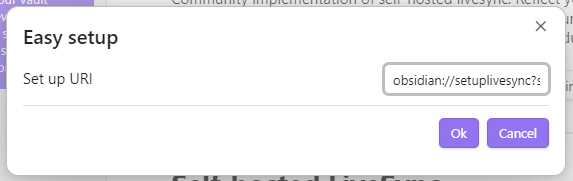

  c. Enter the passphrase shared in WhatsApp
  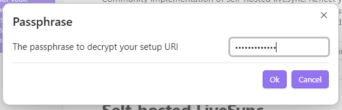

  d. Select "Set it up as a secondary or subsequent device"
  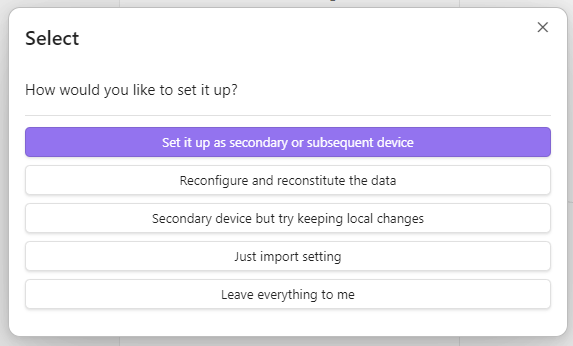
  This should process for ~30 seconds.

  e. Reject additional features.
  
7. Configuration complete.  Look for a few pages to sync to your device.

  
